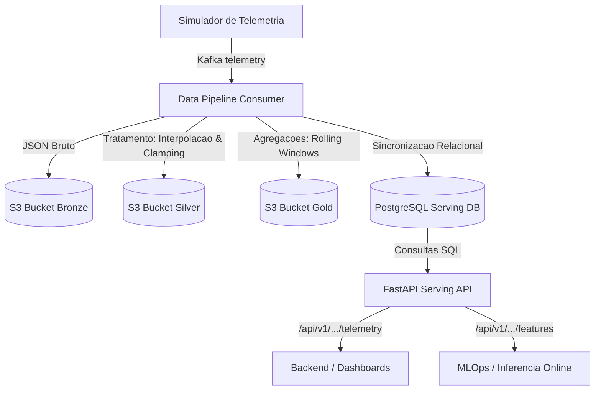

# Guia de Integração Técnica: Serving API e Feature Store

Este guia técnico destina-se às equipes de **Backend (Visualização/Dashboards)** e **MLOps (Inferência Online)** para facilitar a integração com a API de Serving exposta pelo pipeline de dados Medalhão.

A API roda por padrão na porta `18000` e possui documentação interativa OpenAPI (Swagger UI) disponível em:
👉 **`http://localhost:18000/docs`** (ou `http://localhost:18000/redoc` para documentação alternativa)

---

## 🏗️ 1. Arquitetura de Fluxo de Dados

O pipeline opera de forma assíncrona e orientada a eventos, estruturando os dados brutos do Kafka nas camadas do Data Lake e servindo consultas de baixa latência a partir do PostgreSQL:



*   **S3 (MinIO)**: Camada de persistência histórica e analítica de longo prazo (Parquet).
*   **PostgreSQL**: Camada relacional otimizada para consultas pontuais rápidas (Serving).
*   **FastAPI**: Abstração da infraestrutura em endpoints REST.

### 🔄 Estratégia de Disponibilização de Dados (Serving vs. Analytics)

Para otimizar a performance, dividimos a forma de consumo em duas frentes com propósitos específicos:

1. **Serving de Baixa Latência (API + PostgreSQL)**:
   * **Público-alvo**: Backend (Dashboards) e MLOps (Inferência Online).
   * **Como funciona**: O pipeline de dados limpa e agrega a telemetria em tempo real e insere os resultados no banco PostgreSQL. A API FastAPI expõe endpoints REST que consultam essa base relacional para entregar dados e features em poucos milissegundos.
   
2. **Analytics e Retreino de Modelos (S3 + Apache Parquet)**:
   * **Público-alvo**: Cientistas de Dados (treinamento off-line) e Engenharia de Analytics.
   * **Como funciona**: O pipeline grava todo o histórico de dados limpos (Silver) e agregados (Gold) em formato de arquivos compactados Parquet no S3. Os cientistas podem conectar Jupyter Notebooks, Spark ou DuckDB diretamente nos buckets S3 para carregar terabytes de dados históricos para o retreino de modelos sem impactar a API ou o banco de produção.

---

## 🗄️ 2. Estrutura do PostgreSQL Serving DB

### Tabela Física `stg_silver_telemetry` e View `silver_telemetry`
Contém as séries históricas tratadas e confluídas. Os sensores não aplicáveis a um determinado tipo de equipamento permanecem como `NULL`.
Para manter a compatibilidade do Backend inalterada ("do jeito que está"), a tabela física é nomeada **`stg_silver_telemetry`**, mas é exposta para o Backend através da View **`silver_telemetry`** (que aponta diretamente para a tabela física).

*   **Chave Primária**: `(timestamp, equipamento_id)`
*   **Campos de Metadados**:
    *   `timestamp` (DateTime): Grade horária regular tratada.
    *   `equipamento_id` (Integer): Código do ativo.
    *   `hospital_id` (Integer): ID do hospital.
    *   `tipo` (String): Tipo do equipamento (`tc`, `rx`, `rm`, `pet`, `us`, `c_arm`).
    *   `is_interpolated` (Boolean): Flag de auditoria (True se o ponto foi estimado).
*   **Campos de Sensores**: Colunas individuais de float/int (ex: `tube_temp`, `gantry_vibration_fft`, `exposure_count`, `helium_level` etc.).

### Tabela `gold_equipment_features`
Armazena a feature store de MLOps contendo as rolling windows calculadas.

*   **Chave Primária**: `(timestamp, equipamento_id)`
*   **Campos**:
    *   `timestamp` (DateTime): Fim da janela causal.
    *   `equipamento_id` (Integer): ID do equipamento.
    *   `is_interpolated` (Boolean): Indica se o registro base é interpolado.
    *   `features` (JSON/JSONB): Dicionário de mais de 130 features (ex: `tube_temp_mean_6h`, `gantry_vibration_fft_std_24h` etc.).

---

## 📡 3. Guia de Integração para o Backend (Dashboards)

O time de Backend consome os dados históricos da camada **Silver** (via view/tabela `silver_telemetry`) para plotar as curvas de sensores e painéis de saúde dos equipamentos na interface do usuário.

### Endpoints: Histórico de Telemetria Tratada
*   **Consulta por Equipamento**:
    *   **Método**: `GET`
    *   **Rota**: `/api/v1/equipments/{id}/telemetry`
    *   **Query Params**: `limit` (opcional, padrão `48`)
*   **Consulta por Hospital (Multi-Hospital)**:
    *   **Método**: `GET`
    *   **Rota**: `/api/v1/hospitals/{hospital_id}/telemetry`
    *   **Query Params**: `limit` (opcional, padrão `100`)
*   **Comportamento de Retorno**: Retorna um array de objetos ordenados por data decrescente. **Campos nulos são omitidos** da resposta para economizar payload de rede.

#### Exemplo de Resposta (Equipamento do Tipo Tomógrafo - TC):
```json
[
  {
    "timestamp": "2026-06-16T21:33:01.450887",
    "equipamento_id": 1,
    "hospital_id": 1,
    "tipo": "tc",
    "is_interpolated": false,
    "tube_temp": 105.0,
    "tube_current": 349.341,
    "anode_rotation_speed": 9760.093,
    "detector_temp_drift": 3.676,
    "slip_ring_error_rate": 0.003,
    "gantry_vibration_fft": 0.274,
    "gantry_rotation": 0.394
  }
]
```

### 🎨 Diretrizes de Visualização no Frontend:
1.  **Destaque de Interpolação**: Pontos onde o campo `"is_interpolated"` for `true` representam dados que foram reconstruídos linearmente pelo pipeline (gaps originais menores que 2h). Recomenda-se plotar estes pontos no gráfico usando **linhas tracejadas** ou marcadores de cor amarela para alertar os técnicos de que a telemetria foi estimada pelo pipeline.
2.  **Downtime (Equipamento Offline)**: Se houver um intervalo de tempo maior que 2 horas sem dados na série temporal correspondente, significa que o equipamento ficou desligado ou incomunicável. O gráfico frontend deve **deixar um espaço em branco** (não conectar os pontos) para indicar período de inatividade.

#### Snippet de Integração (JavaScript / Fetch):
```javascript
async function carregarDadosGrafico(equipamentoId) {
  try {
    const response = await fetch(`http://localhost:18000/api/v1/equipments/${equipamentoId}/telemetry?limit=24`);
    if (!response.ok) throw new Error("Falha ao carregar telemetrias");
    
    const dados = await response.json();
    
    // Mapeamento para o ChartJS / ApexCharts
    const labels = dados.map(d => new Date(d.timestamp).toLocaleString("pt-BR"));
    const temps = dados.map(d => d.tube_temp);
    const estilos = dados.map(d => d.is_interpolated ? "dashed" : "solid"); // Define o estilo de linha por ponto
    
    renderizarGrafico(labels, temps, estilos);
  } catch (error) {
    console.error("Erro na integração:", error);
  }
}
```

---

## 🤖 4. Guia de Integração para MLOps (Inferência Online)

O time de MLOps consome os dados agregados da camada **Gold** para obter as últimas janelas rolantes e alimentar modelos preditivos em tempo real.

### Endpoints: Últimas Features de MLOps
*   **Consulta por Equipamento (Inferência Online)**:
    *   **Método**: `GET`
    *   **Rota**: `/api/v1/equipments/{id}/features`
    *   **Comportamento**: Retorna um único objeto JSON contendo o dicionário com todas as **130+ features** calculadas do ativo específico.
*   **Consulta Geral (Multi-Equipamento - Batch/Lote)**:
    *   **Método**: `GET`
    *   **Rota**: `/api/v1/features`
    *   **Comportamento**: Retorna uma lista de objetos contendo as features mais recentes de **todos os equipamentos** ativos.

#### Exemplo de Resposta:
```json
{
  "timestamp": "2026-06-16T21:33:01.450887",
  "equipamento_id": 1,
  "is_interpolated": false,
  "features": {
    "tube_temp_mean_6h": 42.92,
    "tube_temp_std_6h": 0.54,
    "tube_temp_max_72h": 68.21,
    "gantry_vibration_fft_mean_24h": 0.31,
    "gantry_vibration_fft_std_24h": 0.005,
    "slip_ring_error_rate_mean_12h": 0.003
  }
}
```

### 🧠 Como Alimentar o Modelo de Machine Learning (Python):
O time de MLOps pode ler o dicionário retornado no campo `"features"`, convertê-lo diretamente em um DataFrame de uma linha do Pandas e passá-lo ao modelo `predict()`. O mapeamento de colunas é idêntico ao do dataset de treino, eliminando qualquer risco de vazamento de dados (*data leakage*) por usar agregação retrospectiva causal.

#### Snippet de Integração (Python / Requests + Pandas):
```python
import requests
import pandas as pd
import joblib

# Modelo previamente carregado
modelo_classificador = joblib.load("modelo_falhas.pkl")

def obter_previsao_falha(equipamento_id):
    url = f"http://localhost:18000/api/v1/equipments/{equipamento_id}/features"
    try:
        response = requests.get(url)
        if response.status_code == 404:
            print(f"Sem dados de MLOps para o equipamento {equipamento_id}")
            return None
        response.raise_for_status()
        
        data = response.json()
        
        # Converte as features agregadas diretamente para um DataFrame de 1 linha
        df_features = pd.DataFrame([data["features"]])
        
        # O DataFrame ja contem as colunas formatadas: 'tube_temp_mean_6h', 'tube_temp_std_6h', etc.
        probabilidade = modelo_classificador.predict_proba(df_features)[0][1]
        
        return {
            "timestamp": data["timestamp"],
            "equipamento_id": data["equipamento_id"],
            "is_interpolated": data["is_interpolated"],
            "probabilidade_falha": probabilidade
        }
    except Exception as e:
        print(f"Erro na inferência online: {e}")
        return None
```

---

## 🏥 5. Monitoramento de Saúde da Infraestrutura

Para verificar a saúde do banco de serving (PostgreSQL) e do serviço (Liveness/Readiness Probe) ou Zabbix:

*   **Método**: `GET`
*   **Rota**: `/api/v1/health`
*   **Resposta (Saudável - HTTP 200)**:
    ```json
    {
      "status": "healthy",
      "database": "connected"
    }
    ```
*   **Resposta (Instável - HTTP 500)**: Ocorre caso o PostgreSQL esteja inalcançável.

---

## 🔗 6. Endpoint Unificado (Backend & MLOps)

Para facilitar a integração e reduzir o número de chamadas de rede, criamos um endpoint unificado que retorna tanto o histórico de telemetrias limpas (Silver, para o Backend) quanto o vetor de features mais recente (Gold, para MLOps) de um ativo específico sob um hospital determinado.

*   **Método**: `GET`
*   **Rota**: `/api/v1/hospitals/{hospital_id}/equipments/{equipment_id}`
*   **Query Params**: `limit` (opcional, padrão `48` para o histórico de telemetria)
*   **Resposta (Sucesso - HTTP 200)**:
    ```json
    {
      "hospital_id": 1,
      "equipamento_id": 1,
      "telemetry": [
        {
          "timestamp": "2026-06-16T21:33:01.450887",
          "equipamento_id": 1,
          "hospital_id": 1,
          "tipo": "tc",
          "is_interpolated": false,
          "tube_temp": 105.0,
          "tube_current": 349.341,
          "anode_rotation_speed": 9760.093,
          "detector_temp_drift": 3.676,
          "slip_ring_error_rate": 0.003,
          "gantry_vibration_fft": 0.274,
          "gantry_rotation": 0.394
        }
      ],
      "features": {
        "timestamp": "2026-06-16T21:33:01.450887",
        "equipamento_id": 1,
        "is_interpolated": false,
        "features": {
          "tube_temp_mean_6h": 42.92,
          "tube_temp_std_6h": 0.54,
          "tube_temp_max_72h": 68.21,
          "gantry_vibration_fft_mean_24h": 0.31,
          "gantry_vibration_fft_std_24h": 0.005,
          "slip_ring_error_rate_mean_12h": 0.003
        }
      }
    }
    ```
*   **Caso de Erro (HTTP 404)**: Retornado caso a associação entre hospital e equipamento seja inválida ou não haja registros.

